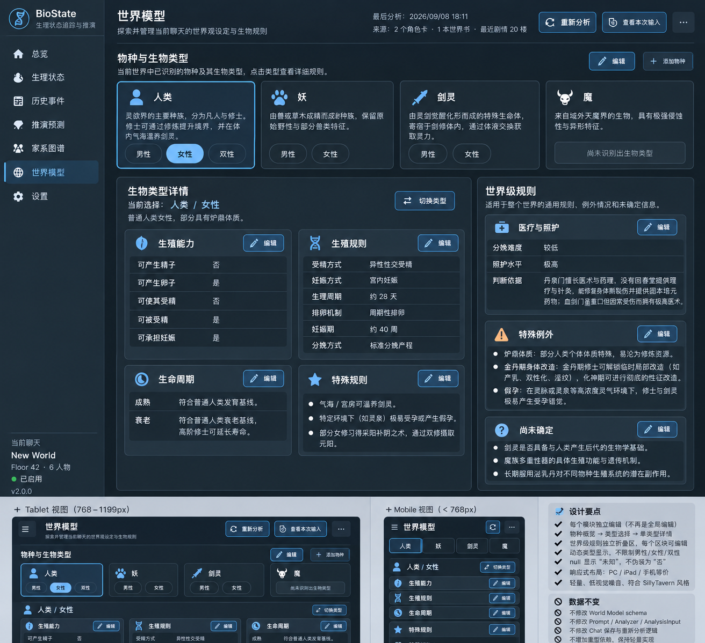
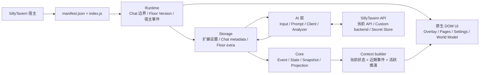
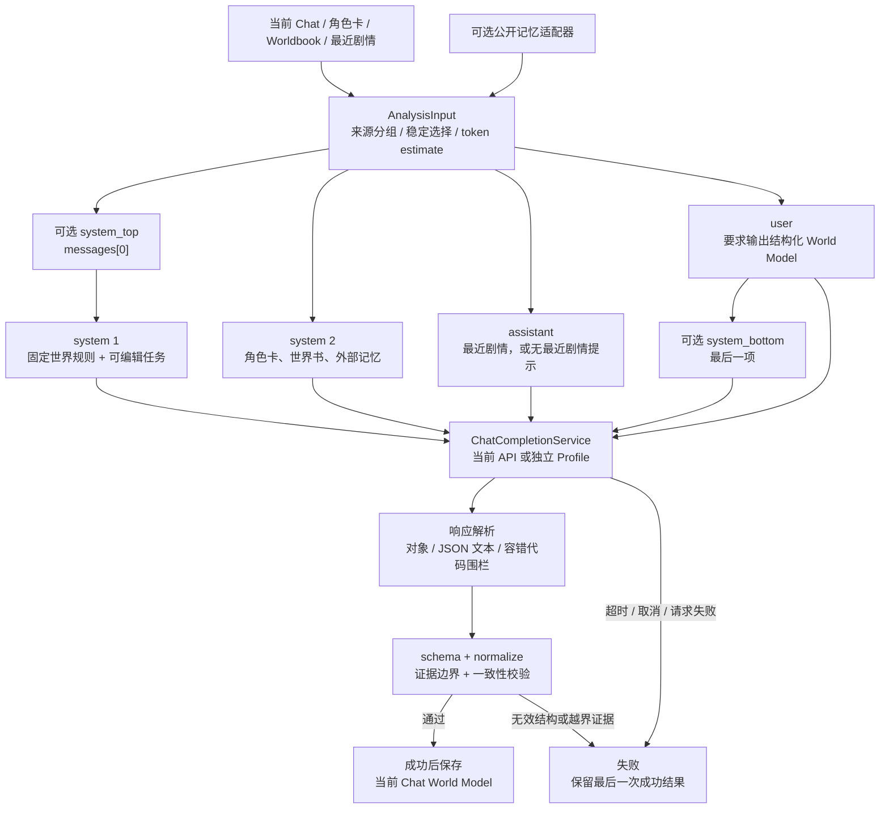

# BioWeave

> 面向 SillyTavern 的 Chat-local 生理状态建模与世界规则分析扩展。

当前版本：0.2.2-dev · 项目形态：SillyTavern 第三方扩展 · 实现：原生 JavaScript / HTML / CSS

BioWeave 用结构化数据记录故事中的生理事件、状态、世界规则和非事实推演，并将当前 Chat 的相关上下文整理给 AI。它适合长篇角色扮演、原创物种设定和需要持续追踪生理变化的剧情。插件直接运行在 SillyTavern 中，不包含独立后端、独立数据库或单独的账号系统。

> **开发状态**：项目仍在快速迭代中。World Model、输入选择、API Profile/Secret、宿主生命周期和响应式 UI 已有较完整实现；Phase 2A 的 Event / Tracking Subject 本地闭环已实现，真实 SillyTavern 宿主验收待完成。完整状态推演、Projection 生命周期及 Context 注入不属于本阶段已完成能力。

## 目录

- [项目概览](#项目概览)
- [核心能力](#核心能力)
- [效果展示与参考界面](#效果展示与参考界面)
- [适用场景](#适用场景)
- [安装](#安装)
- [快速开始](#快速开始)
- [使用说明](#使用说明)
- [系统架构](#系统架构)
- [AI / World Model 工作流](#ai--world-model-工作流)
- [技术栈](#技术栈)
- [项目结构](#项目结构)
- [配置说明](#配置说明)
- [性能与可扩展性](#性能与可扩展性)
- [安全与隐私](#安全与隐私)
- [当前状态与路线图](#当前状态与路线图)
- [开发与贡献](#开发与贡献)
- [常见问题](#常见问题)
- [License](#license)

## 项目概览

BioWeave 的核心思路是把故事中的生理信息拆成不同可信度和生命周期的数据层：

| 数据层 | 含义 | 当前保存位置 |
| --- | --- | --- |
| BiologicalEvent | 剧情中发生过的生理事实或候选事实；完整 NSFW 历史事实的单一来源 | 产生事件的楼层消息 extra.bioweave，或对应 swipe 的 extra.bioweave |
| Tracking Subject Registry | 已进入妊娠相关追踪流程的人物索引；Subject 不复制 Event，只保存稳定人物信息和 event_id 引用 | 当前 Chat 的 `chat_metadata.bioweave` |
| Current State | 由事件按确定性规则归约出的状态 | 下一阶段的当前 Chat 数据结构 |
| Snapshot | 用于恢复或检查的状态检查点 | 当前楼层数据和 Chat 索引 |
| Projection | 面向后续剧情的非事实推演 | 当前楼层消息的 BioWeave 数据 |
| World Model | 当前 Chat 的物种、生物类型和世界级生殖规则 | chat_metadata.bioweave |

插件不会把 AI 的一次输出直接当作最终事实。World Model 分析结果要经过响应解析、固定 schema、字段规范化和证据边界校验；失败时保留最后一次成功结果。

### 当前功能分层

| 模块 | 状态 | 说明 |
| --- | --- | --- |
| World Model v1 | ✅ 可用 | 当前 Chat 世界模型的分析、查看、重新分析和模块级编辑。 |
| AnalysisInput / Worldbook | ✅ 可用 | 角色卡、世界书、最近剧情和可选公开记忆的选择、预览与输入构建。 |
| API Profile / Secret | ✅ 可用 | 使用 SillyTavern 当前 API，或配置独立的 OpenAI-compatible Profile。 |
| Runtime / Storage | ✅ 基础实现 | Chat 切换、楼层版本、作用域校验、宿主生命周期和失败保护。 |
| Event / Tracking Subject | ✅ Phase 2A 本地闭环 | 已接通固定 Event、Floor/Swipe 绑定、Tracking Registry、人物/事件/总览真实 DTO；真实 SillyTavern 宿主验收仍待完成。 |
| State / Snapshot / Projection / Genealogy | 🧩 后续阶段基础结构 | 本阶段保持空状态或兼容骨架，不实现完整妊娠计算、状态归约、快照恢复、推演和家系推导。 |
| 多人总览、人物详情、事件、推演、家系 | 🧪 UI 基础/占位 | 页面路由和界面骨架已建立；Phase 2A 页面只能消费真实业务 DTO，接入前使用真实空状态，不写入演示数据。 |

## 核心能力

1. **以当前 Chat 为一级作用域**：聊天切换会重置运行时焦点和异步边界，避免把 A Chat 的状态写入 B Chat。
2. **World Model 结构化分析**：按 species → biological_types 保存开放的生物分类，不把男性、女性或“双性”写死成 UI 选项。
3. **证据边界与未知值**：没有资料支持的能力保持 null，界面显示为“未知”，不会把未知误判为“否”；人类 baseline 与非人类证据分开处理。
4. **可控的 AI 输入**：选择角色卡字段、世界书条目、最近剧情楼层和可用的公开记忆来源，生成可预览的 AnalysisInput。
5. **Phase 2A 追踪边界**：人物列表只显示已进入妊娠相关流程的 Tracking Subjects，不是当前 Chat 的全角色列表；是否进入由 BiologicalEvent、World Model、Narrative Evidence 和 reproductive capability 共同决定，UI 不参与判断。
6. **楼层版本与失败保护**：通过 Chat、message、swipe、内容 SHA-256 和版本号识别楼层；相同成功版本不自动重复分析，失败可重试且保留旧成功结果。
7. **轻量响应式 UI**：不引入 React/Vue 或 UI 组件库，使用原生 DOM、主题变量和 Desktop / Tablet / Mobile 布局。

## 效果展示与参考界面

当前仓库没有经过真实 SillyTavern 运行环境截取的发布截图，先保留截图补充位置：

<!-- TODO: 添加实际运行截图或 GIF，展示扩展入口、World Model、设置和移动端布局。 -->

已有图片和 HTML 是设计参考资料，不等同于当前版本的运行截图：



- [World Model UI v3 静态参考实现](docs/references/BioWeave_World_UI_reference_v3.html)
- [UI v2.0 完整设计文档](docs/references/BioWeave_UI_v2.0_design.md)
- [World Model UI 开发规范 v2](docs/references/BioWeave_World_UI_开发规范_v2.md)

参考设计强调：当前 Chat 是数据边界、总览面向多人、World Model 按物种和生物类型浏览、每个规则模块独立编辑，以及 PC / Tablet / Mobile 的布局适配。

## 适用场景

- 长篇角色扮演中，需要持续追踪周期、妊娠、分娩、产后或其他生理事件。
- 有自定义物种、生物类型、受精方式或医疗照护规则的世界观。
- 希望在每个 Chat 内独立分析世界规则，而不是把一个故事的设定泄漏到其他 Chat。
- 开发或测试 SillyTavern 扩展中的 API 配置、Worldbook 选择、宿主事件和响应式界面。

BioWeave 面向虚构故事和 AI 辅助创作，不是现实世界的医疗决策工具。

## 安装

### 环境要求

- 可加载第三方扩展的 SillyTavern 实例。
- 浏览器端运行；运行时不需要单独启动 BioWeave 服务。
- 项目本身没有 npm 第三方依赖，因此启用扩展不要求 npm install。
- Node.js >=18 仅用于本地开发时运行语法检查和测试脚本。
- 需要一个可由 SillyTavern 当前 API 或独立 OpenAI-compatible Profile 访问的模型，才能执行 AI 分析。

当前仓库没有提供 Dockerfile、Docker Compose 或其他容器部署配置；请按 SillyTavern 第三方扩展方式加载。

### 方式一：让 AI 编程助手安装

将以下提示词交给能够操作本地文件的 AI 编程助手，并根据你的 SillyTavern 路径确认最终目录：

```text
请帮我把 BioWeave 安装到当前 SillyTavern：

1. 从 https://github.com/tianwuziyan/ST-BioWeave.git 克隆仓库。
2. 将仓库目录放入当前 SillyTavern 版本对应的第三方扩展目录，常见位置是
   <SillyTavern>/public/scripts/extensions/third-party/ST-BioWeave。
3. 检查 manifest.json 中的 js/css 文件路径存在，且 hooks 名称与 index.js 导出的生命周期函数匹配；不要修改项目源码或把 API Key 写入仓库。
4. 运行时不要安装额外 npm 包；如果需要验证开发环境，只检查 Node.js 是否 >=18。
5. 重启或刷新 SillyTavern，在输入框的扩展入口中确认出现 BioWeave，并告诉我如何打开它。
6. 如果宿主版本的第三方扩展目录不同，优先使用该版本的实际目录，并保留仓库的目录结构。
```

### 方式二：命令行安装

将下面的 /path/to/SillyTavern 替换为本机 SillyTavern 目录。不同宿主版本的第三方扩展目录可能不同，以当前版本实际目录为准。

```bash
git clone https://github.com/tianwuziyan/ST-BioWeave.git /path/to/SillyTavern/public/scripts/extensions/third-party/ST-BioWeave
```

更新已有安装：

```bash
cd /path/to/SillyTavern/public/scripts/extensions/third-party/ST-BioWeave
git pull
```

克隆后重启或刷新 SillyTavern。无需在扩展目录运行 npm install。

### 方式三：手动安装

1. 下载或复制本仓库完整目录。
2. 将目录放入 SillyTavern 当前版本的第三方扩展目录。
3. 确认 manifest.json、index.js、style.css 和 ui/、ai/ 等目录位于同一个扩展根目录下。
4. 重启或刷新 SillyTavern，并在扩展菜单中启用 BioWeave。
5. 如果入口没有出现，检查浏览器控制台和宿主扩展加载日志，确认 manifest.json 中的 js / css 路径可读。

### 安装验证

安装成功后，从 SillyTavern 输入框的魔法棒入口打开扩展菜单，应看到 BioWeave 项。点击后应出现独立的 BioWeave overlay，而不是把主界面嵌在临时扩展菜单中。

开发者可在仓库根目录执行：

```bash
node --version   # 应为 v18 或更高
npm run check    # index.js 语法检查 + 全部 Node 测试
```

## 快速开始

1. **打开 BioWeave**：在 SillyTavern 输入框点击魔法棒，进入 extensionsMenu，选择 BioWeave。
2. **配置分析 API**：打开设置，选择 SillyTavern 当前 API，或创建独立 API Profile，填写 Provider、API URL、模型和临时 API Key。
3. **配置任务分配**：确认 world_analysis 使用当前 API 或目标 Profile；其他任务可按需要配置。
4. **选择分析输入**：在设置中选择当前角色卡字段、已启用的世界书及条目；需要时设置最近剧情楼层、正则规则和可用的外部公开记忆。
5. **预览输入**：先查看 AnalysisInput 的结构和实际 World Model 消息，确认没有不需要的剧情或来源；可编辑的首尾 SYSTEM 会按真实请求位置显示。
6. **分析世界模型**：进入世界模型，点击重新分析。成功后，结果才会写入当前 Chat 的 chat_metadata.bioweave。
7. **按模块维护**：选择一个物种和生物类型，按需编辑生殖能力、生殖规则、生命周期、特殊规则、医疗与照护、例外或未知项；每个模块独立保存或取消。

切换 Chat 后，BioWeave 会重新读取当前 Chat 的数据。World Model 重新分析失败时，原有成功模型不会被清空。

## 使用说明

### 1. API 来源与 Profile

BioWeave 支持两类分析入口：

| 来源 | 行为 |
| --- | --- |
| SillyTavern 当前 API | 优先使用宿主公开的 ChatCompletionService，没有时兼容宿主的 generateRaw。不会把宿主当前 Key 复制到 BioWeave Chat 数据。 |
| 独立 API Profile | 通过 SillyTavern 的 ChatCompletionService 调用 OpenAI-compatible custom backend，Profile 保存地址、模型、参数和 Secret 引用。 |

独立 Profile 的 API 地址填写服务的基础地址即可；项目会清理末尾的 /chat/completions 或 /completions，并拒绝带凭据、查询参数或疑似 Key 的地址。

### 2. Worldbook、角色卡与最近剧情

AnalysisInput 可包含以下来源：

- 当前角色卡的 description、主开场白和 alternate greetings。
- 选中的全局 Worldbook、角色卡关联 Worldbook 及具体条目。
- 最近若干楼层；可按全局和当前 Chat 的正则规则执行提取/清洗。
- 可选的 Anima、柏宝书等公开记忆适配器；数据库记忆当前不会伪装成可用来源。

Worldbook 选择保存稳定的 source_id、entry_id 或 field_key，不依赖显示名称。列表与正文按需加载，并在设置页提供来源统计和输入预览。

“选择为分析输入”不等于“注入每次主楼生成”。它只决定本次 World Model 或其他分析任务可读取的资料。

### 3. World Model

World Model v1 的固定顶层结构为：

```text
schema_version
species[]
  ├── name / description
  └── biological_types[]
        ├── name / description
        ├── capabilities
        ├── reproduction_rules
        ├── lifecycle
        └── special_rules[]
medical_context
exceptions[]
unknowns[]
```

几个重要规则：

- biological_types 必须属于对应的 species，不接受旧式的顶层平铺猜测。
- 生物类型名称开放；Alpha、Omega、无性或世界观自定义类型可以由证据产生。
- 能力字段采用 true / false / null 三态；null 表示资料不足，不表示否定。
- 人类男性/女性的 baseline 只在适用且没有更具体证据冲突时使用；不会把人类规则泄漏给非人类物种。
- “双性”需要固定存在的明确证据；临时变化、可能性、模糊描述不会被当作固定类型。
- AI 重新分析是整份 World Model 的重建；人工编辑只修改当前模块，不进入整个 JSON 大表单。

### 4. 其他页面与当前边界

当前 UI 路由包括总览、人物、事件、推演、家系、世界模型和设置。World Model 与设置是当前 Chat 级页面；人物详情的焦点不会改变 Chat 作用域。

事件、状态、Snapshot、Projection 和 Genealogy 页面已经有渲染壳或领域模块，但部分页面仍使用空状态/演示 DTO。它们不会把演示数据写入 Chat，也不应被理解为已经完成端到端自动追踪。

## 系统架构

BioWeave 是宿主内运行的前端扩展，没有独立服务进程。入口负责挂接 SillyTavern 生命周期和扩展菜单；Runtime 负责作用域与事件；Storage 负责宿主设置、Chat metadata 和楼层 extra；Core 负责纯领域结构；AI 负责输入、请求和校验；UI 负责 overlay、路由和编辑交互。



### 数据边界

| 边界 | 保存内容 | 作用域 |
| --- | --- | --- |
| 扩展设置 | API 来源、Profile、Profile assignments、请求超时/重试、全局最近剧情规则、World Model 可编辑提示块 | SillyTavern 全局扩展设置 |
| Chat metadata | world_model、World Model 元数据、角色档案、关系、Chat-local 设置和索引 | 当前 Chat |
| Floor extra | 分析状态、事件、Snapshot、Projection | 当前消息/楼层，支持 swipe 隔离 |
| Secret Store | API Secret 的宿主引用和临时生命周期 | SillyTavern 宿主 Secret Store |

核心概念链路为：

```text
Floor Version → BiologicalEvent → Tracking Subject Registry → Characters / Events / Overview
             → State Reducer → Current State → Snapshot → Projection → Context
```

其中 Event 表示历史事实，Tracking Subject 是指向有效 Event 的 Chat-local 索引，State 是计算结果，Snapshot 是检查点，Projection 是明确标注为非事实的推演。Phase 2A 只闭环到 Event、Tracking Subject 和人物/事件/总览页面；StateReducer、Snapshot、Projection、Genealogy 和完整妊娠计算保持空状态或下一阶段边界。

### Phase 2A Event / Tracking 契约

- 人物列表只来自当前 Chat 的 active Tracking Subject Registry。普通聊天角色、主卡角色、出现过的名字和不满足受孕暴露条件的参与者不会自动进入人物列表。
- 只有可靠识别的 `sexual_activity` Event，在参与者存在、World Model 与 Narrative Evidence 支持 reproductive capability，且本次事件存在实际受孕暴露可能时，才允许创建或更新 Subject。`gender`、攻受/receiver 文本、姓名和 UI 选择都不能替代这项判断；`null` 仍是 unknown，不得变为 `true`。
- BiologicalEvent 保存完整 NSFW 历史事实，是唯一事实来源。Tracking Subject 只保存稳定人物标识、active 状态和 `created_from_event_id` / `exposure_event_ids[]` 等引用，不复制完整 Event；详细字段和绑定规则见 [数据模型与存储边界](docs/DATA-MODEL.md)。
- Event 的 `source` 必须绑定 `chat_id`、`message_id`、`floor`、`swipe_id`、`content_hash`、`message_version`；存在 swipe 结构时只读写对应 `message.swipe_info[swipe_id].extra.bioweave`，不能回退到另一个 swipe 或 Chat-level 事件账本。
- `story_time` 使用结构化对象保存 `display`、`normalized`、`calendar_id`、`day_index`、`provider`、`precision`、`confidence`。`display` 只由 formatter 展示，排序和计算不得重新解析显示文本；无法可靠得到规范值时保留 `null`。
- `counterpart_ids` 和 `gestational_subject_ids` 永远是数组，可为空、单项或多项；姓名只用于显示，关联使用稳定 `character_id`。
- 本阶段保留其它 BiologicalEvent 类型兼容，但只实现 `sexual_activity` 的 Tracking 闭环；妊娠概率、Gestational Age、预计分娩日、完整状态归约、Snapshot、Projection 和 Genealogy 仍是空状态或下一阶段。

## AI / World Model 工作流

### 请求流程

World Model 分析不是把所有宿主上下文直接拼给模型。ai/input-builder.js 先依据当前 Chat 设置收集和清洗输入，ai/prompts.js 再生成可选首尾 SYSTEM 包围的四条普通 Chat Completion 消息：



### 分析约束

- 固定核心提示词负责保持输出边界；用户可编辑顶部/尾部 SYSTEM、任务、输入前缀、输入后缀和显示标签，但不能删除代码层的 schema 与证据规则。
- AI 只提取资料中有证据的事实。非人类物种的能力字段不会因为名称或人类常识自动补全。
- 解析器接受对象、普通 JSON 文本及部分容错文本，但写入前必须通过结构校验。
- 当前 API 优先复用 SillyTavern 的 ChatCompletionService；独立 Profile 走宿主 custom backend，并沿用全局超时和有限重试策略。
- 超时和主动取消不自动重复请求；网络错误和部分 5xx 错误可按设置进行有限重试。
- 项目当前没有 RAG、embedding、向量数据库或多智能体调度。Worldbook 是来源选择与缓存，不是向量检索系统。

### Phase 2A Event Analyzer 边界

Event Analyzer 的输入必须包含当前 Chat Scope、当前 Floor Version、当前楼层叙事、必要的最近剧情上下文、World Model、结构化 Story Time 和必要的角色设定上下文。成功响应只能是固定 JSON 对象 `{schema_version, events[]}`，解析后的 Event 通过统一 normalize / validate 后才可写入 Floor；自然语言自由输出或半结构化结果不得写入。

自动分析继续使用当前 Chat 的 `analysis_interval`（N-floor）和六字段 Floor Version 去重：同一成功版本不会因为 UI 初始化、打开或重新打开而重复请求；版本变化和失败允许重试；`manual: true` 的手动刷新强制请求。手动刷新成功替换该 Floor Version 的旧成功 Event，失败保留旧成功结果，但旧版本事实不能进入当前有效 Registry。Floor 删除、Swipe 切换、Event 编辑/删除后，当前有效 Event 集合和 Registry 必须重新筛选或重建。

当前文档记录的是 Phase 2A 的批准契约，不把上述闭环写成已经通过真实宿主验证的功能。完成实现后仍需刷新/重装实际 SillyTavern 插件，在真实 Chat 中验证 N-floor 触发、重复打开不重复请求、Event JSON 解析、Floor/Swipe extra 位置、删除/编辑和 Story Time provider；Node 检查不能替代这些验收。

### 外部记忆边界

Anima 与柏宝书适配器只探测宿主公开接口，并把可读取的公开内容作为可选输入；数据库记忆当前标记为不可用。外部来源的启用状态、可用性和内容摘要会区分展示，不会为了填充输入而读取宿主私有内部结构。

## 技术栈

| 层次 | 技术/实现 | 说明 |
| --- | --- | --- |
| 扩展运行时 | 原生 JavaScript ES Modules | package.json 使用 type: module，无 UI 框架。 |
| 宿主集成 | SillyTavern Context、事件类型、ChatCompletionService、Secret Store API | 通过适配器隔离宿主差异。 |
| UI | 原生 DOM、HTML 字符串片段、CSS 变量 | ui/app.js 统一路由、主题、overlay 和事件委托。 |
| 响应式 | CSS Media Query | Desktop >=1200px、Tablet 768–1199px、Mobile <768px。 |
| AI 请求 | 当前 API / OpenAI-compatible custom backend | 由 ai/client.js 统一超时、重试、错误摘要和脱敏。 |
| 数据存储 | SillyTavern 扩展设置、Chat metadata、消息 extra | 不使用独立数据库。 |
| 测试 | Node.js built-in test runner | npm test 执行 tests/*.test.js。 |

## 项目结构

```text
.
├── ai/
│   ├── analyzer.js          # World Model / Floor / Projection 分析与校验
│   ├── client.js            # 当前 API、独立 API、超时、重试与安全错误
│   ├── input-builder.js     # AnalysisInput、来源清洗、最近剧情
│   ├── prompts.js           # 核心提示词、四段 World Model 消息
│   └── worldbook.js         # Worldbook/角色卡来源、选择与缓存
├── context/
│   └── builder.js           # Context DTO 与序列化
├── core/
│   ├── events.js            # BiologicalEvent schema、规范化、校验与排序
│   ├── genealogy.js         # 稳定 character_id 的关系排序与查询
│   ├── projection.js        # 非事实 Projection 规范化与筛选
│   ├── snapshot.js          # Snapshot 间隔、检查点与恢复基础
│   └── state.js              # 纯状态归约基础
├── runtime/
│   ├── chat.js              # Chat token、epoch、stale guard
│   ├── events.js            # SillyTavern 适配器、宿主事件、存取入口
│   └── floor.js              # Floor Version、分析去重、失败保护
├── storage/
│   ├── schema.js            # Global/Chat/Floor 默认值与规范化
│   └── store.js              # Profile、Secret、Chat、Floor 存储边界
├── story/
│   ├── seven-days-cal.js    # Anima/柏宝书公开记忆探测与适配
│   └── time.js              # Story Time provider 与结构化时间适配
├── ui/
│   ├── app.js               # overlay、路由、主题、状态、事件委托
│   ├── characters.js        # 人物列表/详情基础页面
│   ├── events.js            # 事件页面骨架
│   ├── genealogy.js         # 家系页面骨架
│   ├── overview.js          # 多人总览基础页面
│   ├── projection.js        # 推演页面骨架
│   ├── settings.js          # API、Worldbook、输入预览、提示词设置
│   ├── state.js             # 状态页面基础组件
│   └── world.js             # World Model 浏览和模块级编辑
├── utils/
│   ├── hash.js              # 通用 hash 工具
│   └── helpers.js           # 通用 DOM/值处理
├── tests/                   # API、Runtime、UI、World Model、Worldbook 与 Core 测试
├── docs/                    # 数据模型、开发规范、UI 设计与参考实现
├── index.js                 # 扩展入口与 SillyTavern 生命周期 hooks
├── manifest.json            # SillyTavern 扩展清单
├── settings.html            # 宿主设置入口的说明抽屉
├── style.css                # bioweave-* 作用域样式和响应式布局
└── package.json             # Node 版本与开发测试脚本
```

### 重要入口

- index.js：创建 Runtime 与 App，挂载 overlay，向 SillyTavern 扩展菜单注册入口，并导出 onInstall、onUpdate、onEnable、onDisable、onActivate、onDelete。
- ui/app.js：拥有页面路由、当前 Chat 状态、主题、overlay 生命周期和全局事件委托。
- storage/schema.js / storage/store.js：集中定义配置和数据保存边界，避免 API Profile 或 Secret 进入 Chat 数据。
- ai/analyzer.js：把模型输出解析为固定 World Model，并执行分析专用的证据边界与一致性校验。

## 配置说明

### 全局扩展设置

全局配置位于 SillyTavern 的扩展设置命名空间，主要字段如下：

| 字段 | 作用 | 默认/取值 |
| --- | --- | --- |
| api_source | 默认 API 来源 | sillytavern 或 bioweave |
| default_profile_id | 默认独立 Profile | 无则为 null |
| api_profiles | 独立 API Profile 集合 | 每个 Profile 含 Provider、地址、模型、上下文/输出参数、secret_ref |
| assignments | 任务到 API 的分配 | world_analysis、event_analysis、projection、history_scan |
| api_request_settings.timeout | 请求超时（毫秒） | 默认 180000，范围 250–600000 |
| api_request_settings.retry_count | 可重试次数 | 默认 1，范围 0–3 |
| recent_story_global.regex_rules | 全局最近剧情规则 | 最多 50 条，单条 pattern 最多 2000 字符 |
| world_analysis_prompt | World Model 的可编辑首尾 SYSTEM、任务/输入文本 | 代码层核心约束仍然保留 |

任务 assignments 可以指向 default、SillyTavern 当前 API 或已保存的 Profile ID。没有有效 Profile 时不会静默使用不匹配的配置。

### API Profile 与 Secret

Profile 的非敏感字段包括：

```json
{
  "name": "本地模型",
  "provider": "OpenAI-compatible",
  "api_url": "https://example.invalid/v1",
  "model": "your-model",
  "context_size": 8192,
  "max_output_tokens": 4096,
  "temperature": 0.2,
  "secret_ref": "由宿主生成的引用"
}
```

secret_ref 只是引用，不是 API Key 本身。API Key 通过宿主 Secret Store 的写入/删除边界管理；插件的 Profile、Chat metadata、Floor extra、错误摘要和输入预览都不应保存明文 Key。

### 当前 Chat 设置

Chat-local settings 主要包括：

| 字段 | 作用 |
| --- | --- |
| worldbooks | selected_only / all / none 及稳定条目选择 |
| recent_story | 最近剧情楼层数、正则规则和是否读取用户楼层；楼层数为 0 时不读取 |
| external_memory | anima、baobaoshu、database_memory 的启用意向；实际可用性仍由适配器确认 |
| context_injection | Context 注入开关与最大 token 设置；完整注入链路仍在建设 |
| analysis_interval / snapshot_interval | 分析和 Snapshot 的间隔基础配置 |
| projection_enabled / retry_failed_analysis | 推演与失败重试意向 |

当前 Chat 的固定数据骨架由 emptyChat(chatId) 创建，包含 chat_scope、world_model、world_model_meta、character_profiles、relationships、settings 和 index。Phase 2A 的 Chat-local 字段包含 `tracking_subjects` Registry：它是人物列表唯一来源，只保存进入追踪流程的人物索引和有效 Event 引用；老 Chat 缺少该字段时按空 Registry 读取，不把所有角色迁入通用生理数据库。`character_profiles` 只为真正进入追踪的角色保留最小、带证据的资料，不复制完整 Event。

### Floor 数据

每个楼层的基础结构为：

```json
{
  "v": 1,
  "analysis": null,
  "events": [],
  "snapshot": null,
  "projections": []
}
```

存在 swipe 结构时，数据只能写入对应 `message.swipe_info[n].extra.bioweave`，包括 swipe `0`；没有 swipe 结构时使用 `message.extra.bioweave`。Floor `events[]` 是该消息/版本的绑定事实集合，不是 Chat-level 唯一事件大数组。每个 Event 的 `source` 绑定六字段 Floor Version，删除楼层或切换到没有事件的 swipe 后旧 Event 不再参与当前有效状态。Runtime 会校验 Chat scope 和异步 epoch，避免旧 Chat 的保存操作覆盖当前 Chat。

## 性能与可扩展性

当前实现采取轻量、低重复请求的策略：

- Worldbook 列表、正文、并发加载和 generation cache 分开管理；只有展开或选中的来源才延迟读取正文。
- 输入构建保留来源分组和 token estimate，方便在发送 AI 请求前控制资料规模。
- Floor Version 对文本计算 SHA-256；相同楼层的成功分析不会自动重复执行，编辑内容、swipe 或版本改变才会重新分析，失败和手动刷新遵守各自的替换/保留规则。
- 自动分析继续按 N-floor 间隔触发，UI mount/open/reopen/init 不触发 AI；真实 SillyTavern 的宿主事件、Swipe 形状和实际 AI 请求仍需人工验收。
- 请求超时、主动取消和网络/5xx 重试分类明确；失败不会无界重试。
- Chat boundary token/epoch 会拒绝过期异步读写；UI overlay、路由和主题状态由单一 App owner 管理，避免重复挂载。
- 领域 Core 尽量使用纯函数，便于独立测试，也避免把宿主 DOM 或请求逻辑带进 reducer。

当前主要成本仍来自模型请求和过长的角色卡、世界书、最近剧情。项目没有后端任务队列或多租户服务；若未来需要批量分析，可在保持 Chat/Floor 数据契约的前提下增加异步调度层，而不是在前端加入无界并发。

## 安全与隐私

- API Key 不写入 Profile、Chat metadata、Floor extra、提示词预览或错误消息；Profile 只保留 Secret 引用。
- 独立 API URL 会拒绝 URL 用户名/密码、查询参数和疑似 token/key 内容，并移除 completion 路径。
- 错误摘要只返回认证、地址、超时、服务不可用等安全分类，不直接回显上游错误正文。
- 外部记忆适配器使用宿主公开接口；不可用来源不会通过私有内部结构“猜测”内容。
- Chat/Floor 存取包含作用域检查和 stale-chat 保护；swipe 数据按对应消息分离。
- UI 的用户内容、Worldbook 内容和模型文本按页面渲染边界处理；不要把未脱敏的 API 配置复制进 issue、截图或调试日志。

BioWeave 不提供独立用户认证、权限系统或服务端隔离能力；宿主 SillyTavern 的访问控制和 API 权限仍是最终边界。

## 当前状态与路线图

### 已具备

- SillyTavern manifest、入口、生命周期 hooks 和独立 documentElement overlay。
- Chat/Floor 作用域、楼层版本 hash、stale async guard 和失败保留策略。
- API Profile、任务分配、超时/重试、模型列表和宿主 Secret Store 边界。
- 角色卡/Worldbook 稳定来源选择、延迟加载、最近剧情规则和输入预览。
- World Model v1 schema、首尾可选 SYSTEM 加四段普通消息、JSON 解析、证据 guard、模块级编辑和 Chat 保存。
- Tavern / Light / Dark 主题与 Desktop / Tablet / Mobile 基础布局。

### Phase 2A 与后续建设

- 完成 Phase 2A 的固定 Event JSON 分析、Floor/Swipe 持久化、Tracking Registry 重建以及人物/事件/总览真实 DTO 接线。
- 在真实 SillyTavern 中验证自动 N-floor、Floor Version 去重、失败可重试、手动刷新成功替换/失败保留和宿主删除/切换语义。
- 后续再完成 Event 之外的完整 State Reducer、时间/周期/妊娠确定性计算、Snapshot 恢复、Projection 管理、Genealogy 推导和 Context 注入链路。
- 用真实 Chat 数据替换人物、事件和总览页面中的空状态；Projection/Genealogy 继续保持空状态直到各自阶段。
- 补充真实 SillyTavern 环境下的 Desktop、Tablet、Mobile 手动验收截图。
- 在正式发布前补充仓库 License 和明确的发布/更新渠道。

## 开发与贡献

### 本地开发

```bash
git clone https://github.com/tianwuziyan/ST-BioWeave.git
cd ST-BioWeave

node --version
npm test
npm run check
```

npm test 执行 node --test tests/*.test.js；npm run check 先检查 index.js 语法，再执行同一组测试。项目运行时没有 npm 依赖，因此本地检查也不需要构建 bundler。

### 测试覆盖

- api-profile.test.js：Profile、Secret、模型发现、请求超时/重试和安全错误。
- world-model.test.js：schema、JSON 解析、物种/生物类型、证据边界、提示词、输入预览和模块编辑。
- worldbook.test.js：来源规范化、稳定选择、缓存、延迟加载、最近剧情和公开记忆适配器。
- runtime.test.js / ui.test.js：Chat 边界、宿主事件、overlay 生命周期、扩展菜单和响应式 UI 约束。
- events.test.js、floor.test.js、genealogy.test.js、snapshot.test.js、state.test.js：Core 与 Floor 的纯函数基础。

### 贡献约定

1. 修改前先阅读 [开发文档](docs/DEVELOPMENT.md)、[数据模型](docs/DATA-MODEL.md) 和 [UI 文档](docs/UI.md)。
2. 保持原生 JS 和现有模块边界；不要为单次逻辑引入新的框架、全局 Store 或大量薄封装。
3. 涉及宿主生命周期、路由、作用域、API 或数据结构时，同时补充对应的回归测试。
4. UI 修改至少检查 Desktop、Tablet、Mobile 三种布局，并确认没有横向溢出或重复挂载。
5. 未完成的业务层使用空状态或明确的占位，不要把演示 DTO 写入 Chat/Floor 数据。
6. 提交说明应具体描述实际改动；不要把未完成能力写成已发布功能。

## 常见问题

### 运行扩展前必须执行 npm install 吗？

不需要。运行时没有 npm 第三方依赖；Node.js >=18 只用于仓库开发检查和测试。

### 从哪里打开 BioWeave？

点击 SillyTavern 输入框的魔法棒，打开扩展菜单，选择 BioWeave。主 overlay 挂在 documentElement 下，不依赖临时扩展菜单作为 UI 容器。

### API Key 保存在哪里？

独立 Profile 只保存 secret_ref。明文 Key 通过宿主 Secret Store 的写入/删除接口处理，不落入 Chat metadata、楼层 extra 或 README 中的示例配置。

### Worldbook 选中了，为什么不会自动注入每次聊天？

Worldbook 选择当前表示分析输入来源。它会影响 AnalysisInput 和 World Model 预览，不等于已经接通每次主楼生成的 Context 注入。

### 为什么某个字段显示“未知”而不是“否”？

null 表示资料没有足够证据。BioWeave 有意区分未知和明确否定，避免模型依据人类常识替自定义物种补全规则。

### 重新分析失败会丢掉旧世界模型吗？

不会。解析失败、结构无效、超时或请求失败时，当前 Chat 保留最后一次成功的 World Model；失败信息作为分析元数据记录。

### Projection 是已经发生的事实吗？

不是。Projection 是非事实的后续推演，和 Event 的历史事实边界分开；当前 Projection 的完整生命周期仍在建设。

### 人物列表为什么不等于当前 Chat 的全部角色？

人物列表只展示已经进入妊娠相关追踪流程的 Tracking Subjects。角色要先由 BiologicalEvent、World Model、Narrative Evidence 和明确的 reproductive capability 共同支持，并存在实际受孕暴露可能；普通出场角色、只有姓名或未知能力的参与者不会自动建立人物卡。UI 只展示 Registry 结果，不负责重新判断资格。

### Event 和人物卡分别保存什么？

完整 NSFW 历史事实只保存在 Floor-bound BiologicalEvent。人物卡/Tracking Subject 只保存稳定 `character_id`、显示名、active 状态和 `event_id` 引用；详情通过有效 Event 读取 exposure，不能把完整 Event 复制到人物索引。

### Story Time 的 display 可以用于排序吗？

不能。Story Time 持久化为结构化对象；`display` 只是 formatter 的显示结果。排序或后续计算只能使用 `normalized`、`day_index` 等结构化字段，无法可靠得到的值必须保留 `null`。

### 项目支持 Docker 或独立数据库吗？

当前不支持。项目是运行在 SillyTavern 内的前端扩展，没有 Docker 配置，也没有独立数据库和迁移系统。

### 仓库使用什么开源许可证？

当前仓库未提供 LICENSE 文件。正式分发前请由项目维护者补充明确许可证；在此之前不要自行假设为 MIT、Apache-2.0 或其他许可证。

## License

当前仓库未提供 LICENSE 文件，许可证状态待项目维护者确认。除非仓库后续补充正式许可证，否则请不要将本项目或其代码按某个特定开源许可证重新分发。

## 相关文档

- [数据模型与存储边界](docs/DATA-MODEL.md)
- [开发规范与模块边界](docs/DEVELOPMENT.md)
- [UI 行为与页面说明](docs/UI.md)
- [UI v2.0 完整设计](docs/references/BioWeave_UI_v2.0_design.md)
- [World Model UI 开发规范 v2](docs/references/BioWeave_World_UI_开发规范_v2.md)
- [World Model UI 静态参考](docs/references/BioWeave_World_UI_reference_v3.html)

项目地址：[tianwuziyan/ST-BioWeave](https://github.com/tianwuziyan/ST-BioWeave)
