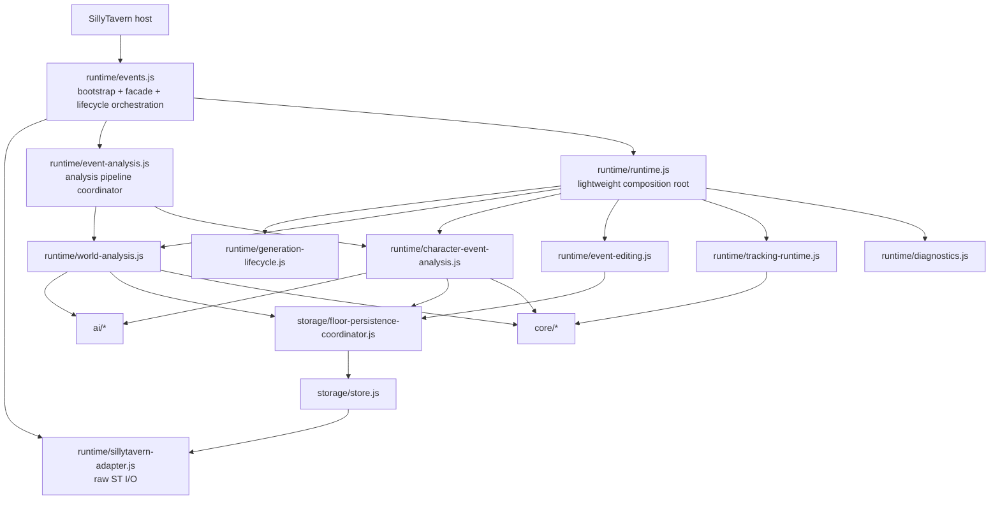

# BioWeave 当前架构导航

本文是当前工作树的 canonical developer navigation。它说明“一个功能由哪里负责”、模块之间允许怎样依赖，以及修改某类问题时的第一落点。历史 Trellis task 的 PRD、design 和 implement 文档保留为历史记录，不作为当前模块地图。

## 总体边界

BioWeave 的基础架构重构已完成。后续优先修产品行为，不再为了文件大小继续拆分；只有形成独立生命周期、状态边界或可独立测试职责的新功能，才创建新的 feature module。



依赖方向的硬规则：Adapter 不依赖业务 feature；feature 不直接依赖 UI 或 SillyTavern transport；Storage 不依赖 runtime feature；Generation Lifecycle 不反向导入 `events.js`；普通 Floor 写入不绕过 Coordinator。

## Feature-to-file map

| Feature | Primary owner | 负责什么 |
| --- | --- | --- |
| Runtime Diagnostics | `runtime/diagnostics.js` | trace 缓冲、payload 安全格式化、diagnostic DTO 和查询 |
| Event Editing | `runtime/event-editing.js` | 已存在 Biological Event 的 update/delete workflow |
| Tracking Runtime | `runtime/tracking-runtime.js` | 从有效 Floor facts 重建并刷新 Tracking Registry |
| World Analysis | `runtime/world-analysis.js` | World 查询、Full/Supplement/Patch、World AI orchestration、结果 readback/readiness；业务语义见 [World Model and World Analysis Contract](../.trellis/spec/domain/world-model.md) |
| Character/Event Analysis | `runtime/character-event-analysis.js` | Event AI、parse/normalize、identity、Event patch、readback 和成功后的桥接 |
| Generation Lifecycle | `runtime/generation-lifecycle.js` | generation intent、settle barrier、supersede、exactly-once handoff |
| SillyTavern Adapter | `runtime/sillytavern-adapter.js` | 原始 Host context、Chat/Floor slot I/O、HTTP transport、listener subscribe |
| Runtime Composition | `runtime/runtime.js` | create / inject / assemble / return；不拥有业务状态 |
| Analysis Pipeline Coordinator | `runtime/event-analysis.js` | execution ownership、runAnalysis、generic retry、scheduler、World→Event pipeline、terminal 和 shared bridges |
| ST integration / compatibility facade | `runtime/events.js` | 顶层 bootstrap、public facade、lifecycle orchestration、source cleanup 和冻结的 persistence-policy bridge |
| Floor Persistence Coordinator | `storage/floor-persistence-coordinator.js` | ordinary owner-scoped Floor transaction、merge、save、readback、confirmed decision |
| Projection | `storage/projection.js` | `snapshot` / `projection_timeline` 的 Projection owner workflow |
| Storage primitives | `storage/store.js` | Floor/Chat storage abstraction 与 host-store compatibility |
| Clear / special lifecycle | `storage/clear.js` | explicit clear、restore/migration 和特殊生命周期操作 |
| AI input construction | `ai/input-builder.js` | AnalysisInput 收集、选择、清洗和规范化 |
| Analyzer boundary | `ai/analyzer.js` | analyzer invocation、raw response 解析和结果规范化入口 |
| Prompt construction | `ai/prompts.js` | World/Event 等 analyzer prompt 和 contract |
| Character Evidence projection | `ai/input-builder.js` | 从 raw/runtime sources 构建 source-specific semantic Character Evidence；不创建 canonical identity |
| Character identity domain | `core/identity.js` | canonical ID、existing/new/unresolved、alias candidate 与 registry invariants |
| Tracking domain | `core/tracking.js` | eligibility、candidate/subject derivation 和 registry rebuild algorithm |
| Pregnancy Exposure Tracking lifecycle | `.trellis/spec/domain/pregnancy-tracking.md` | Proposed Window lifecycle contract；当前尚未有独立 Runtime owner |
| Snapshot domain | `core/snapshot.js` | snapshot candidate、检查点和恢复相关 domain logic |
| State domain | `core/state.js` | derived state reducer/domain state logic |
| UI orchestration | `ui/app.js` | overlay、页面动作和 Runtime API 调用 |
| Characters UI | `ui/characters.js` | Characters 页面渲染；当前主要枚举 `tracking_subjects` |

## Where do I change this?

| Problem / feature | 第一站 | 可能的第二站 | 通常不要先改 |
| --- | --- | --- | --- |
| World analysis bug | `runtime/world-analysis.js` | `ai/analyzer.js`、`ai/input-builder.js`、`ai/prompts.js` | `floor-persistence-coordinator.js`、Adapter |
| Character/Event analysis bug | `runtime/character-event-analysis.js` | `core/events.js`、`core/identity.js`、AI 层 | `runtime/generation-lifecycle.js` |
| Manual World action | `runtime/world-analysis.js` | `runtime/event-analysis.js`、`ui/app.js` | Persistence transport |
| Manual Character action | `runtime/event-analysis.js` explicit `analyzeCurrentCharacterEvents()` routing | `runtime/world-analysis.js` read-only World prerequisite、`runtime/character-event-analysis.js`、`ui/app.js` | Adapter、Generation state、`resolveFinalWorldModelForAnalysis()` |
| Event parsing/normalization | `core/events.js`、`ai/analyzer.js` | `runtime/character-event-analysis.js` | UI |
| Event editing | `runtime/event-editing.js` | `core/events.js`、`core/identity.js` | Event AI stage |
| Character identity | `core/identity.js` | `runtime/character-event-analysis.js` | `core/tracking.js` |
| Tracking behavior | `core/tracking.js` | `runtime/tracking-runtime.js` | `character_registry` persistence |
| Characters UI | `ui/characters.js` | `ui/app.js`、business DTO bridge | Event persistence schema |
| Generation auto-trigger | `runtime/generation-lifecycle.js` | `runtime/events.js` host forwarding、`runtime/event-analysis.js` handoff | World/Event implementation |
| Generation settle | `runtime/generation-lifecycle.js` | lifecycle tests | Persistence |
| Retry behavior | `runtime/event-analysis.js` | World/Event attempt modules | Generation state |
| Scheduler | `runtime/event-analysis.js` | settings/runtime wiring | Adapter |
| Diagnostics | `runtime/diagnostics.js` | caller-specific trace emission | General event bus |
| AI input construction | `ai/input-builder.js` | `runtime/event-analysis.js` caller | Persistence |
| World prompt | `ai/prompts.js` | `ai/analyzer.js` | Event runtime |
| Event prompt | `ai/prompts.js` | `ai/input-builder.js` | World runtime |
| Snapshot | `core/snapshot.js`、`core/state.js` | pipeline snapshot bridge | Adapter |
| Projection | `storage/projection.js`、`core/projection.js` | `ui/projection.js` | World/Event direct writes |
| Floor persistence | `storage/floor-persistence-coordinator.js` | owner caller、`storage/store.js` | direct host save |
| F5 durability | Coordinator + `storage/store.js` + Adapter bridge | real ST validation | analysis modules |
| Swipe ownership | `runtime/floor.js`、`storage/store.js` | Coordinator/Adapter raw slot access | UI-only code |
| ST HTTP transport | `runtime/sillytavern-adapter.js` | `runtime/events.js` compatibility bridge | business feature |
| ST lifecycle listener registration | Adapter subscribe API | `runtime/events.js` callback wiring | Generation module |
| Source cleanup | `runtime/events.js`、`storage/clear.js` | lifecycle contract | Adapter policy |
| Settings | `ui/settings.js`、settings/storage callers | `runtime/events.js` host/settings glue | new Settings service |
| Clear/reset | `storage/clear.js` + owning runtime bridge | `runtime/events.js` orchestration | ordinary Floor writer |

## Feature module creation rule

1. 已有 feature owner 能完整说明职责时，扩展该 owner。
2. 只需要少量 shared orchestration 时，通过 `event-analysis.js` 或 `runtime.js` 的 narrow capability wiring 连接，不注入整个 coordinator。
3. 只有独立生命周期、独立 state/behavior boundary、清晰 public capability 或可独立测试的完整职责，才创建新 feature module。
4. 不要把新的独立 feature 继续堆进 `runtime/events.js` 或 `runtime/event-analysis.js`。
5. 不要为了一个 helper 或一个 function 创建碎片 module。

原则是 **ONE FEATURE OWNER, NOT ONE FUNCTION PER FILE**。

## 两个仍然较大的 Runtime 文件

### `runtime/events.js`

它不是通用 feature dumping ground，但仍是顶层 ST integration shell、compatibility facade、lifecycle orchestration、source cleanup integration、settings/enabled glue 和冻结 persistence-policy bridge 的组合边界。以下路径是 KNOWN-GOOD / FROZEN：

- `inspectOfficialFloorOwner`
- `acquireAuthoritativeFloorOwner`
- `bootstrapOfficialFloorOwner`
- `saveOfficialFloorSlot`
- host-ahead classification
- official readback / confirmed logic

普通产品功能不得为了方便进入这些路径。

### `runtime/event-analysis.js`

它是 Analysis Pipeline Coordinator，合理保留：`runAnalysis`、execution ownership、cancellation/supersede、generic retry、scheduler、Floor resolver/version guards、World→Event transition、terminal handling、Snapshot/general-derived-state bridge 和 capability wiring。它不是 World、Character/Event、Tracking、Event Editing、Generation state machine 或 Adapter 的 feature owner；新功能不应默认加入这里。

## Generation Lifecycle boundary

`runtime/generation-lifecycle.js` 拥有 pending generation intent、Swipe generation intent、sequence/token、completed markers、`final_character_floor_seen`、`generation_ended`、settle barrier、exactly-once consume、supersede、stop/cancel cleanup、generation diagnostics 和 settled handoff。

核心 invariant：

```text
final_character_floor_seen === true
AND generation_ended === true
→ GENERATION_SETTLED exactly once
```

`CHARACTER_MESSAGE_RENDERED → GENERATION_ENDED` 与反向顺序都必须工作。该模块不拥有 World/Event pipeline、generic retry、scheduler、Persistence、Floor Version policy 或 ST listener registration。

## SillyTavern Adapter boundary

`runtime/sillytavern-adapter.js` 负责 **HOW**：context/settings/raw metadata、Chat/message/Swipe raw access、official GET/SAVE transport、host save request、raw Floor slot read/write、lifecycle subscribe/unsubscribe、prompt host call 和 transport normalization。

它不负责 **WHY**：owner acquisition、Floor Version、stale、host-ahead、sibling merge、confirmed decision、Generation state、World/Event behavior 或 source cleanup policy。新的 ST I/O primitive 放 Adapter；新的 persistence/business decision 不放 Adapter。

## Persistence canonical path

ordinary Floor write path：

```text
World / Event / Event Editing / Projection / Terminal
→ owner-scoped patch
→ FloorPersistenceCoordinator
→ latest authoritative merge
→ host sync
→ official save
→ authoritative readback
→ confirmed
```

Owner whitelist：

| Owner | Allowed fields |
| --- | --- |
| `world` | `world_model`, `world_model_meta` |
| `event` | `analysis`, `events`, `character_registry` |
| `projection` | `snapshot`, `projection_timeline` |
| `terminal` | `analysis` |

普通业务模块不得直接调用 `store.saveFloor`、`/api/chats/save`、`context.saveChat`、`saveOfficialFloorSlot`，也不得直接写任意 `extra.bioweave` 或 `swipe_info[*].extra.bioweave`。Chat clear、source cleanup、lifecycle root invalidation、migration/restore、metadata/settings 和 explicit Floor clear 是特殊操作，不是 ordinary owner-patch precedent。

## Known-good freeze

以下内容未经 root-cause evidence 不应修改：

- `storage/floor-persistence-coordinator.js`
- `runtime/sillytavern-adapter.js`
- `runtime/generation-lifecycle.js`
- `runtime/floor.js`
- `runtime/events.js` 中的 owner inspection/acquisition、host-ahead bootstrap、official save、readback/confirmed 路径

这些路径已通过自动化测试和真实 SillyTavern + F5 durability + Swipe 验证。与产品行为无关的问题不得顺手触碰它们。

## World 与 Character/Event

World Analysis 的 domain owner 是
[`World Model and World Analysis Contract`](../.trellis/spec/domain/world-model.md)：
Full 使用 permitted evidence 重建 complete model，Supplement 使用同一 evidence
set 加 Existing canonical baseline 做 semantic differential，再由 Runtime
deterministically merge 并完成 canonical validation。本文只保留模块导航，不复制
该领域算法；Floor/Swipe ownership 仍以 Floor State Ownership Contract 为准。

### 当前实现与目标契约

当前代码已实现 Manual Character 的独立分析边界：它通过 `analyzeCurrentCharacterEvents()` 读取现有 at-or-before canonical World，不进入 `resolveFinalWorldModelForAnalysis()`，因此不会触发 World AI。缺少可用 World 时以 `WORLD_MODEL_REQUIRED` fail closed，且不写 Event 或 terminal failure。Event prompt 通过 input builder 的 narrow semantic projection 消费 persisted World Model、Current Target Floor、Recent Story、`identity_context`、Character Evidence (`individual_evidence`)、bounded `existing_events` 和 Story Time；raw Character Card、Persona、Worldbook、External Memory 不直接进入 Event prompt，但 Character Card/Persona 的稳定人物证据必须先经过 projection。

目标契约为：

```text
AUTO:             World → Event
MANUAL WORLD:     World only
MANUAL CHARACTER: existing persisted valid World → Event only
                  WORLD_AI_CALLS = 0
                  no valid World → fail closed
```

Analysis Boundary Fix 与 Event Input Boundary Fix 均已实现；Event Input Boundary 不改变 World Analyzer 对 raw Character Card、Persona、Worldbook 和 External Memory 的既有输入。

World feature 以宿主可选来源构建 World Model；Character/Event feature 以已持久化 `world_model`、narrative discovery window（Current Target Floor + bounded Recent Story）、`identity_context`、Character Evidence (`individual_evidence`) 和 bounded existing Events 产生 `events`、`character_registry` 与 `analysis`。正确边界是 `raw/source collection → Character Evidence semantic projection → Character/Event Analyzer`：Runtime wide DTO 可以保留 raw sources 供 World/legacy orchestration，但 Event prompt 不消费 raw sources，也不能因隔离 raw DTO 而失去稳定人物证据。

Event discovery window 与 Event persistence owner 是独立概念。Recent Story 中明确发生且尚未记录的历史 Event 可以在当前分析中被发现，保留自身 `story_time`；Runtime 仍将本轮所有新 Event 写入当前 Character Floor active Swipe，并将 canonical `source` 绑定当前 Floor Version。`existing_bioweave` 仍是最近合法前置 Floor snapshot；`existing_events` 是按 Recent Story 窗口从当前有效 Floor facts 聚合的 bounded semantic-dedupe reference，不是 Chat-level Event cache。identity resolution 后使用确定性完整事实 key 去重，缺少高置信度字段时保留候选。

Character Evidence 只提供 mention identity context、已有 World Model species/type mapping evidence、明确个体生理/生殖 capability evidence 与稳定人物背景。它不是当前 Floor Event、World Model rule、Tracking eligibility、Character Registry identity source 的替代品、Chat-level 持久化字段或 UI 人物列表来源。生理性别可参与已有 type mapping，但不得直接推出 capability；Human baseline 只能由 World Model 建立，Nonhuman 不能套用 Human baseline。未来修改 Event Input Boundary、Prompt trimming 或 AnalysisInput narrowing，必须保留等价 projection，并用最终 `buildEventAnalysisMessages()` 测试验证。
每个已确认 Event participant 都必须执行完整的人物分析，不以 `pregnancy_relevance.relevant === true` 为前提：identity → Character Evidence → species → species 内 biological_type → exact persisted World Model species/type → baseline capabilities → explicit individual capability evidence → final participant biological facts。`pregnancy_relevance` 只描述当前 Event，不能跳过人物 facts，也不能由人物 capability 反推妊娠相关性；证据不足保持 `null`。Tracking 继续消费最终 participant facts，Characters UI 继续消费 `tracking_subjects`，Registry 不直接成为人物列表。

## Character Registry 与 Tracking Subjects

`character_registry` != `tracking_subjects`。

- `character_registry`：Floor-owned canonical identity snapshot。
- `tracking_subjects`：runtime-derived Tracking projection。
- Characters UI 当前主要枚举 `tracking_subjects`。

人物身份的 canonical pipeline 是：

```text
narrative mention
  → identity_context + Character Evidence + previous valid registry snapshot
  → AI identity classification
  → Runtime canonical identity resolution
  → participant canonicalization / Event validation
  → current Floor character_registry snapshot
  → BiologicalEvent
  → tracking_subjects / tracking_candidates
  → Characters UI
```

`core/identity.js` 是 identity domain owner；`runtime/character-event-analysis.js`
负责 Runtime resolution/canonicalization；`ai/input-builder.js` 只负责 Character
Evidence projection；`ai/prompts.js` 维护 AI identity contract；`core/tracking.js`
只负责从 canonical Event 与 participant facts 派生 Tracking；`ui/characters.js`
只负责 presentation。AI 不拥有 canonical ID authority，Registry 不直接成为 UI
人物列表，Tracking 也不负责修复人物识别。

Pregnancy Exposure Tracking Window 目前只有 Proposed Contract，没有独立的
代码 owner、round identity、horizon 或 expiration implementation。不要把
`core/tracking.js` 当前按 subject 聚合的 `tracking_subjects` 当作 Window；也
不要把 `core/state.js` 的 Pregnancy Episode 或 `core/projection.js` 的
Projection lifecycle 当作 Window。后续实现必须继续遵守 Floor/Swipe/Version
authority，并由 [Pregnancy Exposure Tracking Lifecycle](../.trellis/spec/domain/pregnancy-tracking.md)
指导设计。

Event discovery window、identity authority、Event occurrence time 和 persistence
owner 是四个独立概念。Current Target Floor 与 bounded Recent Story 可以共同发现
Event；历史 Event 保留自身 `story_time`，但新结果由当前 active Floor/Swipe 持久化。

未来改变 Characters UI 产品定义应作为独立产品任务，不应偷偷改变 Event persistence schema。

## Safe modification guardrails

- 普通产品修复优先限于对应 feature owner。
- 不为产品行为问题修改 Coordinator、Adapter raw transport、Generation settle 或 Floor Version policy。
- 不把 special clear/restore 写法复制成 ordinary Floor writer。
- 修改 persistence、host integration 或 generation boundary 前，必须有 root-cause evidence，并重新做对应 automated + real-host verification。
- 变更前阅读本文件及相关 domain contract；历史 Phase 文档只用于追溯。
